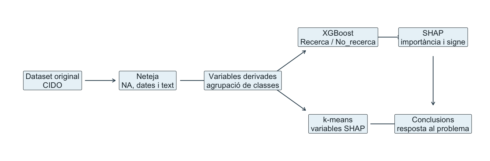
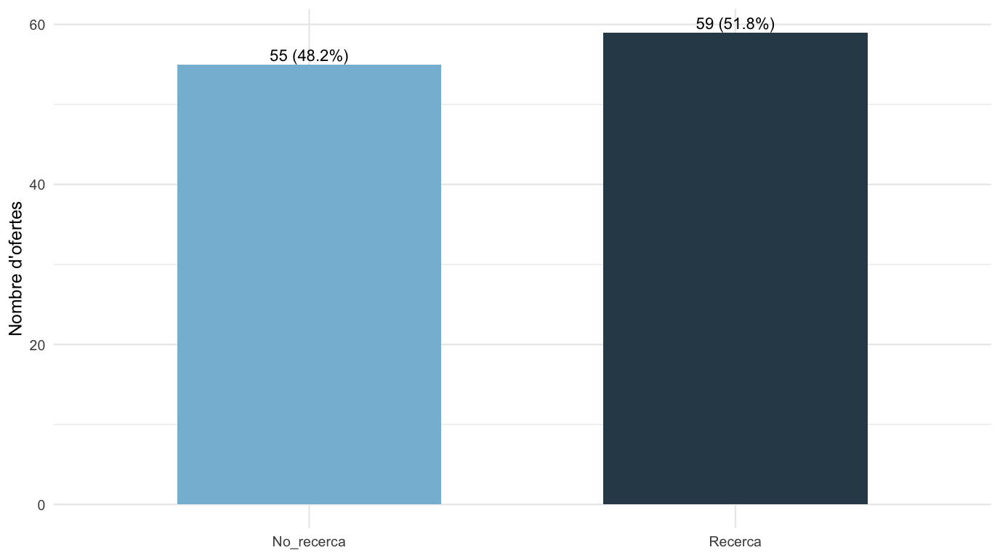
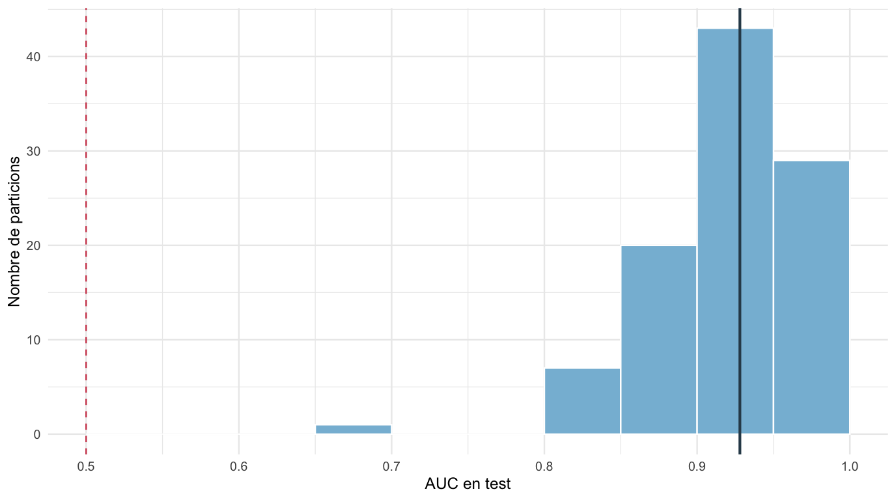
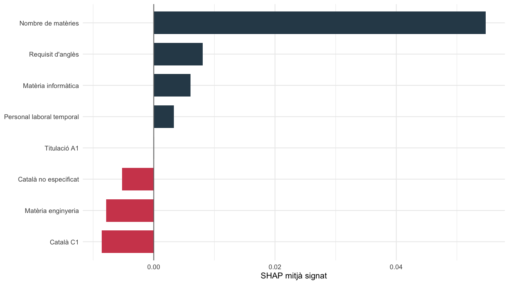
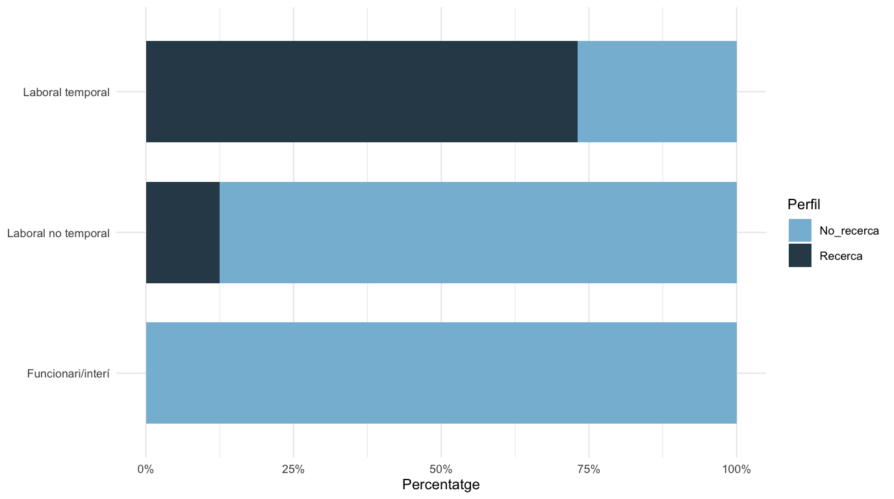

# Dades bàsiques {#dades-bàsiques .unnumbered}

-   **Assignatura:** Tipologia i cicle de vida de les dades
-   **Integrants:** Marc Roige Benaiges i Eloi Vilella Escolano
-   **Font de dades:** portal CIDO d'oposicions i convocatòries
    públiques
-   **Dataset original:** `cido_oposicions.csv`
-   **Dataset final:** `cido_oposicions_analitzades.csv`
-   **Repositori:** <https://github.com/marcrb88/TiC_Practica2.git>

# Resum executiu {#resum-executiu .unnumbered}

Aquesta pràctica parteix del dataset generat a la Pràctica 1 i el
transforma en un conjunt de dades preparat per fer anàlisi. L'objectiu
no és només netejar el fitxer, sinó respondre una pregunta concreta:
**quines característiques administratives, formatives i de requisits
diferencien les ofertes vinculades a recerca de la resta d'ofertes TIC o
informàtiques del CIDO?**

El dataset final conté 114 ofertes i 22 variables. La variable objectiu,
`perfil_recerca`, queda força equilibrada: 59 registres de recerca
(51.8%) i 55 de no recerca (48.2%). Aquesta distribució és important
perquè evita que el model aprengui només la classe majoritària.

La pràctica aplica un model supervisat XGBoost, interpreta el resultat
amb SHAP values, construeix un agrupament k-means amb les variables més
informatives i contrasta estadísticament la relació entre el perfil de
recerca i el tipus de personal. El resultat és consistent: les ofertes
de recerca presenten un patró diferenciat, especialment en el tipus de
personal, el nombre de matèries associades i alguns requisits
lingüístics.

# Descripció del dataset

El dataset recull convocatòries públiques publicades al CIDO
relacionades amb perfils TIC, informàtica, tecnologia, enginyeria i
recerca. Cada fila representa una oferta i conserva camps com el títol,
l'estat, el sistema de selecció, el tipus de personal, el grup de
titulació, les matèries i els requisits addicionals.

La pregunta de treball és:

\begin{quote}
Quines característiques administratives, formatives i de requisits diferencien les ofertes vinculades a recerca de la resta d'ofertes tecnològiques o informàtiques del CIDO?
\end{quote}

Aquesta pregunta és adequada perquè el dataset conté variables
categòriques rellevants i perquè la classe de recerca no queda
infrarepresentada. A més, permet combinar una lectura predictiva amb una
interpretació substantiva del resultat.

  Indicador               Valor
  ----------------------- -----------------------------------
  Registres analitzats    114
  Variables finals        22
  Ofertes de recerca      59 (51.8%)
  Ofertes de no recerca   55 (48.2%)
  Repositori amb codi     github.com/marcrb88/TiC_Practica2
  Fitxer final exportat   cido_oposicions_analitzades.csv

# Integració i selecció de dades

No s'ha integrat una font externa perquè el dataset original ja conté
prou informació per respondre la pregunta: matèries, requisits, sistema
de selecció, tipus de personal i titulació. La decisió principal ha
estat seleccionar i transformar les variables útils, no afegir volum
sense necessitat.

S'han descartat com a predictors els identificadors, les URL i les
variables que podrien introduir informació massa directa o poc
generalitzable. El target `perfil_recerca` s'ha derivat de les matèries,
però `materia_recerca` no s'ha utilitzat com a predictor del model. Això
evita una circularitat evident: no tindria sentit predir recerca fent
servir directament l'indicador que defineix recerca.

::: {.figure style="text-align: center"}

Flux general de la pràctica

:::

# Neteja de les dades

La neteja s'ha organitzat en quatre blocs: tractament de valors buits,
conversió de tipus, gestió de valors extrems i creació de variables
derivades.

Els valors buits i el literal `Vegeu les bases` s'han tractat com a
valors absents, perquè no aporten informació analítica. Les dates s'han
convertit a format temporal extraient la primera data vàlida del camp.
També s'ha normalitzat el text a minúscules i sense accents per detectar
patrons de manera estable.

  -----------------------------------------------------------------------------
  Bloc           Variables                          Justificacio
  -------------- ---------------------------------- ---------------------------
  Requisits      `requereix_angles`,                Permeten analitzar
                 `requereix_catala`,                requisits lingüístics i
                 `requisit_catala_simplificat`      d'idiomes.

  Matèries       `materia_informatica`,             Converteixen text temàtic
                 `materia_tecnologia`,              en indicadors modelables.
                 `materia_enginyeria`,              
                 `perfil_recerca`                   

  Titulació      `grup_titulacio_simplificat`       Agrupa A, A1 i A2 en
                                                    categories més estables.

  Tipus de       `tipus_personal_simplificat`       Redueix categories petites
  personal                                          i separa temporalitat
                                                    laboral.

  Sistema de     `sistema_simplificat`              Diferencia mèrits de
  selecció                                          processos amb prova o
                                                    oposició.

  Temporalitat i `n_materies`, `n_materies_cap`,    Resumeix informació
  volum          `mes_final`, `te_data_final`       temporal i evita pes
                                                    excessiu de valors alts.
  -----------------------------------------------------------------------------

El nombre de matèries per oferta s'ha revisat com a possible valor
extrem. La variable original té valors entre 1 i 6, amb mediana 3. Per
evitar que les ofertes amb més etiquetes temàtiques tinguin massa pes,
s'ha creat `n_materies_cap`, limitada amb la regla de l'IQR.

::: {.figure style="text-align: center"}

Distribució de la variable objectiu

:::

# Anàlisi de les dades

## Model supervisat: XGBoost

El model supervisat utilitzat és XGBoost, amb classificació binària de
`perfil_recerca`. Els predictors inclouen titulació simplificada, tipus
de personal, sistema de selecció, requisits lingüístics, matèries no
circulars i variables temporals.

Per evitar que el resultat depengui d'una única partició train/test,
s'han executat 100 particions estratificades. En cada iteració s'ha
entrenat el model amb validació creuada interna i s'ha avaluat sobre el
conjunt de test.

  Metrica                   Valor
  ----------------------- -------
  AUC mitjana               0.922
  AUC mediana               0.928
  AUC Q1                    0.894
  AUC Q3                    0.955
  Accuracy mitjana          0.849
  Sensibilitat mitjana      0.884
  Especificitat mitjana     0.811

::: {.figure style="text-align: center"}

Distribució de l'AUC en 100 particions train/test

:::

El model obté una AUC mitjana de 0.922 i una AUC mediana de 0.928. Això
indica que les variables seleccionades tenen capacitat real per separar
ofertes de recerca i no recerca. L'accuracy mitjana és 0.849, amb
sensibilitat 0.884 i especificitat 0.811.

\newpage

## Interpretació amb SHAP

L'ús de SHAP és clau perquè el model no quedi només com una predicció
numèrica. La importància absoluta mostra quines variables pesen més; el
signe del SHAP indica si la variable empeny cap a `Recerca` o cap a
`No_recerca`.

  ------------------------------------------------------------------------
  Variable                 SHAP absolut     SHAP mitjà Direcció mitjana
                                  mitjà         signat 
  --------------------- --------------- -------------- -------------------
  Personal laboral                0.977          0.003 Empeny cap a
  temporal                                             Recerca

  Nombre de matèries              0.814          0.055 Empeny cap a
                                                       Recerca

  Requisit d'anglès               0.325          0.008 Empeny cap a
                                                       Recerca

  Català C1                       0.325         -0.009 Empeny cap a
                                                       No_recerca

  Català no especificat           0.225         -0.005 Empeny cap a
                                                       No_recerca

  Matèria informàtica             0.089          0.006 Empeny cap a
                                                       Recerca

  Matèria enginyeria              0.074         -0.008 Empeny cap a
                                                       No_recerca

  Titulació A1                    0.022          0.000 Empeny cap a
                                                       Recerca
  ------------------------------------------------------------------------

::: {.figure style="text-align: center"}

Direcció mitjana dels SHAP values

:::

Les variables més importants són el personal laboral temporal, el nombre
de matèries, el requisit d'anglès i els indicadors del requisit de
català. La lectura principal és que el perfil de recerca no es
diferencia només per la matèria, sinó també per la forma administrativa
de l'oferta.

\newpage

## Model no supervisat: k-means guiat per SHAP

El k-means s'ha aplicat només sobre les variables més rellevants segons
SHAP. Aquesta decisió fa que el model no supervisat sigui més
interpretable: no agrupa les ofertes amb totes les variables possibles,
sinó amb les dimensions que el model supervisat ha detectat com a més
informatives.

  ---------------------------------------------------------------------------------------------------------
    Cluster    N % recerca % anglès % català    Mitjana Titulació      Sistema          Tipus majoritari
                                          C1   matèries majoritària    majoritari       
  --------- ---- --------- -------- -------- ---------- -------------- ---------------- -------------------
          1   41     58.54     0.00     0.00       3.24 Universitari   Mèrits           Laboral temporal
                                                        A1                              

          2   33     12.12     3.03    96.97       2.67 Universitari   Prova/oposició   Funcionari/interí
                                                        A1                              

          3   40     77.50   100.00     0.00       3.67 Universitari   Mèrits           Laboral temporal
                                                        A1                              
  ---------------------------------------------------------------------------------------------------------

El resultat mostra tres perfils. El cluster 2 és clarament menys
vinculat a recerca, amb només 12.12% d'ofertes de recerca. El cluster 3
concentra més recerca, amb 77.5%. Això dona una lectura complementària
al model supervisat: quan es miren les variables més rellevants,
apareixen grups amb proporcions de recerca diferents.

## Contrast d'hipòtesi

La prova estadística s'ha plantejat sobre una relació concreta:

-   **H0:** el perfil de recerca i el tipus de personal simplificat són
    independents.
-   **H1:** el perfil de recerca i el tipus de personal simplificat
    estan associats.

Com que la taula de contingència pot tenir freqüències petites, s'ha
utilitzat el test exacte de Fisher quan no es compleixen les condicions
del khi quadrat. El p-valor obtingut és inferior a 0,001, de manera que
es rebutja la hipòtesi nul·la al 5%.

La conclusió és que el tipus de personal no es distribueix igual entre
ofertes de recerca i no recerca. Aquest resultat encaixa amb la
interpretació SHAP, on el tipus de personal apareix com una de les
variables amb més pes.

# Representació dels resultats

Les representacions s'han distribuït al llarg de la memòria per evitar
concentrar totes les figures al final. S'han utilitzat taules de resum,
gràfics de barres, histogrames de validació, SHAP signat i un diagrama
de flux del procés analític.

::: {.figure style="text-align: center"}

Perfil de recerca segons tipus de personal

:::

# Resolució del problema

Els resultats permeten respondre la pregunta inicial. Les ofertes
vinculades a recerca es poden distingir de la resta a partir de
característiques administratives, formatives i de requisits.

La primera evidència és predictiva: XGBoost obté una AUC mitjana de
0.922 en 100 particions, molt per sobre del valor 0,5 que representaria
una classificació sense capacitat discriminant. La segona evidència és
interpretativa: SHAP mostra que el tipus de personal, el nombre de
matèries i alguns requisits lingüístics expliquen bona part de la
classificació. La tercera evidència és descriptiva: el k-means
identifica grups amb proporcions de recerca molt diferents. Finalment,
el contrast d'hipòtesi confirma una associació estadísticament
significativa entre el perfil de recerca i el tipus de personal.

La conclusió s'ha d'entendre com una lectura exploratòria, perquè el
dataset és petit i prové d'una instantània del portal. Tot i això, els
diferents mètodes apunten al mateix resultat: les ofertes de recerca no
són simplement una etiqueta temàtica dins del CIDO, sinó que tenen un
patró administratiu propi.

# Codi i fitxers lliurats

El codi principal de la pràctica és `TiC_Pract2.Rmd`. Aquest fitxer
conté la neteja, el feature engineering, l'entrenament del model
XGBoost, la interpretació SHAP, el k-means, el contrast d'hipòtesi, les
visualitzacions i l'exportació dels fitxers finals.

  --------------------------------------------------------------------------
  Fitxer                            Funcio
  --------------------------------- ----------------------------------------
  TiC_Pract2.Rmd                    Codi principal de la pràctica

  cido_oposicions.csv               Dataset original

  cido_oposicions_analitzades.csv   Dataset final net i enriquit

  taula_clusters.csv                Resum dels clusters

  importancia_shap_xgboost.csv      Importància global de variables

  direccio_shap_xgboost.csv         Direcció mitjana dels SHAP values

  shap_per_valor_xgboost.csv        SHAP mitjà segons valor de variable

  validacio_xgboost_recerca.csv     Resultats de les 100 particions del
                                    model

  memoria_practica_2.pdf            Memòria final en PDF
  --------------------------------------------------------------------------

# Taula de contribucions

  Contribucio                 Signatura
  --------------------------- -----------
  Investigació prèvia         MRB, EVE
  Redacció de les respostes   MRB, EVE
  Desenvolupament del codi    MRB, EVE
  Participació al vídeo       MRB, EVE

# Bibliografia i recursos

-   Calvo, M., Subirats, L. i Pérez, D. (2019). *Introducción a la
    limpieza y análisis de los datos*. Editorial UOC.
-   Han, J., Kamber, M. i Pei, J. (2012). *Data mining: concepts and
    techniques*. Morgan Kaufmann.
-   Osborne, J. W. (2010). *Data Cleaning Basics: Best Practices in
    Dealing with Extreme Scores*.
-   Chen, T. i Guestrin, C. (2016). *XGBoost: A Scalable Tree Boosting
    System*.
-   Lundberg, S. M. i Lee, S.-I. (2017). *A Unified Approach to
    Interpreting Model Predictions*.
